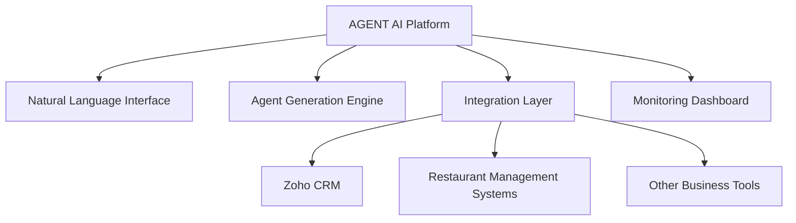
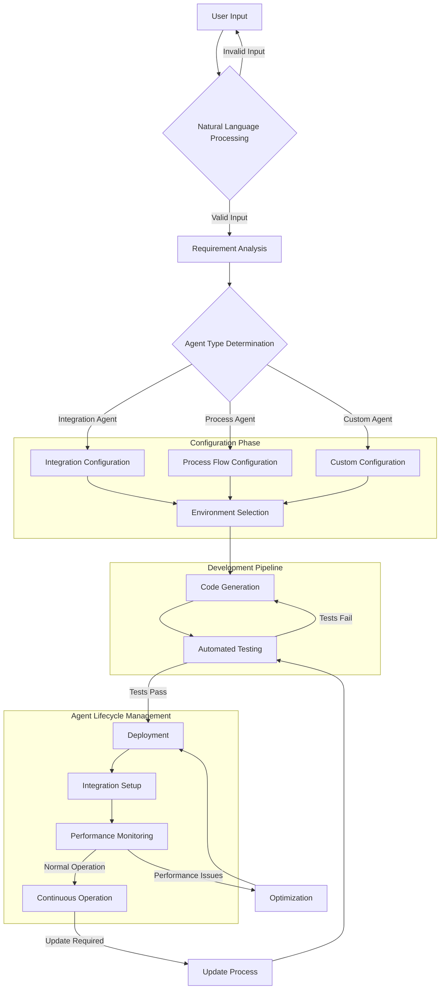
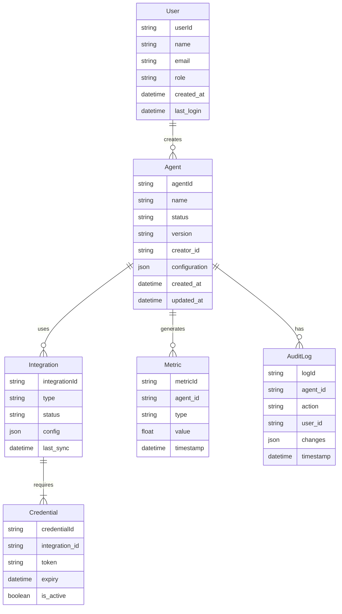
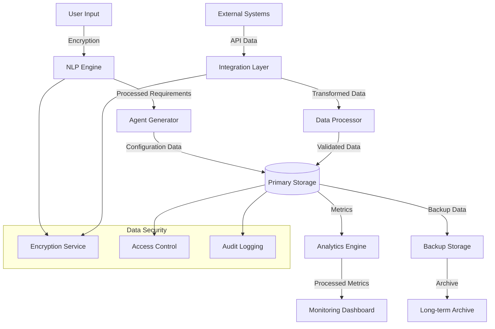
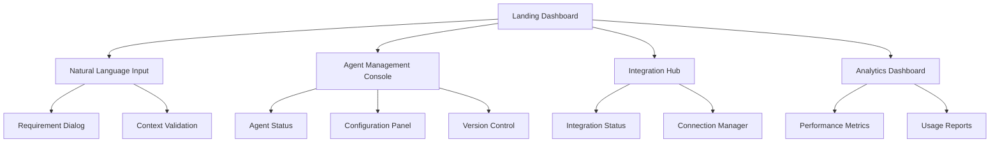
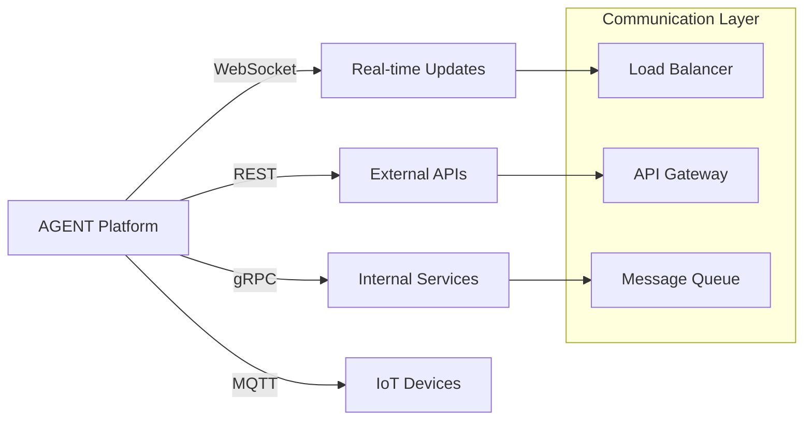

# Product Requirements Document (PRD)

# 1. INTRODUCTION

## 1.1 Purpose

This Software Requirements Specification (SRS) document provides a comprehensive description of the AGENT AI Platform. It details the functional and non-functional requirements for stakeholders including:

- Development team members
- Project managers
- Quality assurance teams
- Business stakeholders
- System architects
- Integration partners

The document serves as the primary reference for technical implementation, testing criteria, and acceptance standards throughout the development lifecycle.

## 1.2 Scope

The AGENT AI Platform is a no-code solution that enables users to create, deploy, and manage AI agents through natural language interactions. The system encompasses:

- Natural language processing engine for interpreting user requirements
- Automated agent generation and deployment system
- Integration framework for third-party services and platforms
- Real-time monitoring and management dashboard
- Role-based access control and security framework

Key Features:
- Conversion of natural language descriptions into functional agent specifications
- Autonomous selection and configuration of development environments
- Automated code generation and deployment
- Integration with external systems (e.g., Zoho, restaurant management software)
- Performance monitoring and iterative improvement capabilities
- Visual dashboard for agent management
- Security and access control mechanisms

Out of Scope:
- Custom hardware requirements
- Physical infrastructure setup
- End-user training programs
- Legacy system migrations
- Manual coding interfaces

# 2. PRODUCT DESCRIPTION

## 2.1 Product Perspective

The AGENT AI Platform operates as a standalone system that interfaces with various external services and systems. The platform sits at the intersection of:

- User-facing natural language interface
- Backend agent generation and management system
- Third-party integration ecosystem
- Cloud infrastructure services

## 2.2 Product Functions

The primary functions of the AGENT AI Platform include:

1. Natural Language Processing
   - Interpretation of user requirements
   - Context understanding and validation
   - Intent mapping to agent specifications

2. Agent Generation
   - Automated code generation
   - Environment configuration
   - Deployment orchestration

3. Integration Management
   - API connectivity
   - Data flow orchestration
   - Authentication handling

4. System Monitoring
   - Performance metrics tracking
   - Error detection and handling
   - Usage analytics

5. Agent Lifecycle Management
   - Version control
   - Updates and modifications
   - Decommissioning

## 2.3 User Characteristics

Target user personas include:

1. Business Professionals
   - Limited technical knowledge
   - Focus on business process automation
   - Need for intuitive interfaces

2. Domain Experts
   - Deep industry knowledge
   - Moderate technical understanding
   - Requirement for specialized integrations

3. System Administrators
   - Technical background
   - Responsible for platform management
   - Need for advanced control features

## 2.4 Constraints

1. Technical Constraints
   - Must operate within cloud service provider limitations
   - API rate limits of integrated services
   - Network bandwidth and latency considerations

2. Regulatory Constraints
   - Data privacy compliance (GDPR, CCPA)
   - Industry-specific regulations
   - Security standards compliance

3. Business Constraints
   - Market-competitive response times
   - Scalability requirements
   - Resource utilization efficiency

## 2.5 Assumptions and Dependencies

Assumptions:
1. Users have basic computer literacy
2. Stable internet connectivity
3. Access to necessary third-party services
4. English language proficiency

Dependencies:
1. External Service Availability
   - Cloud infrastructure services
   - Third-party APIs
   - Integration platforms

2. Technology Stack
   - NLP processing capabilities
   - Container orchestration services
   - Database management systems

3. Business Environment
   - User organization's IT policies
   - Integration partner relationships
   - Market conditions and requirements

# 3. PROCESS FLOWCHART

The flowchart illustrates the end-to-end process flow of the AGENT AI Platform, from initial user input through agent deployment and ongoing management. Key stages include natural language processing, requirement analysis, agent configuration, automated development, testing, deployment, and continuous monitoring.

# 4. FUNCTIONAL REQUIREMENTS

## 4.1 Natural Language Processing Engine

| ID | Description | Priority |
|---|---|---|
| NLP-01 | Process and interpret natural language inputs describing business requirements | High |
| NLP-02 | Extract key parameters and constraints from user descriptions | High |
| NLP-03 | Validate input completeness and request clarification when needed | Medium |
| NLP-04 | Support context-aware conversations for requirement refinement | Medium |
| NLP-05 | Handle multiple languages and regional variations | Low |

## 4.2 Agent Generation System

| ID | Description | Priority |
|---|---|---|
| AGS-01 | Automatically select appropriate development environments and tools | High |
| AGS-02 | Generate compliant code based on extracted requirements | High |
| AGS-03 | Configure deployment environments and dependencies | High |
| AGS-04 | Implement automated testing and validation | Medium |
| AGS-05 | Support version control and rollback capabilities | Medium |

## 4.3 Integration Framework

| ID | Description | Priority |
|---|---|---|
| INT-01 | Connect with Zoho CRM systems | High |
| INT-02 | Interface with restaurant management software | High |
| INT-03 | Manage API authentication and token refresh | High |
| INT-04 | Handle data transformation between systems | Medium |
| INT-05 | Support custom API integrations | Low |

## 4.4 Monitoring Dashboard

| ID | Description | Priority |
|---|---|---|
| MON-01 | Display real-time agent performance metrics | High |
| MON-02 | Alert on system errors or performance issues | High |
| MON-03 | Provide usage analytics and reporting | Medium |
| MON-04 | Track resource utilization and costs | Medium |
| MON-05 | Generate performance optimization recommendations | Low |

## 4.5 Security Framework

| ID | Description | Priority |
|---|---|---|
| SEC-01 | Implement role-based access control | High |
| SEC-02 | Encrypt sensitive data in transit and at rest | High |
| SEC-03 | Maintain audit logs of system activities | High |
| SEC-04 | Enforce secure coding practices in generated code | Medium |
| SEC-05 | Support single sign-on integration | Low |

## 4.6 Agent Lifecycle Management

| ID | Description | Priority |
|---|---|---|
| ALM-01 | Manage agent deployment and updates | High |
| ALM-02 | Handle agent configuration changes | High |
| ALM-03 | Support agent decommissioning and cleanup | Medium |
| ALM-04 | Maintain agent dependency management | Medium |
| ALM-05 | Provide agent backup and restore capabilities | Low |

# 5. NON-FUNCTIONAL REQUIREMENTS

## 5.1 Performance Requirements

| Requirement | Description | Target Metric |
|------------|-------------|---------------|
| Response Time | Maximum time for NLP processing of user input | < 2 seconds |
| Agent Generation | Time to generate and deploy new agent | < 5 minutes |
| API Latency | Maximum latency for integration endpoints | < 200ms |
| Concurrent Users | Number of simultaneous users supported | 1000+ |
| Resource Usage | Maximum CPU utilization per agent | < 30% |
| Memory Usage | Maximum memory footprint per agent | < 512MB |
| Database Performance | Query response time | < 100ms |

## 5.2 Safety Requirements

| Requirement | Description |
|------------|-------------|
| Data Backup | Automated daily backups with 30-day retention |
| Failure Recovery | Automatic failover within 30 seconds |
| State Management | Transaction rollback capabilities for failed operations |
| Error Handling | Graceful degradation of services during partial system failure |
| Data Validation | Input sanitization and validation before processing |
| Monitoring | Real-time system health monitoring and alerting |

## 5.3 Security Requirements

| Requirement | Description |
|------------|-------------|
| Authentication | Multi-factor authentication support |
| Authorization | Role-based access control (RBAC) with least privilege principle |
| Data Encryption | AES-256 encryption for data at rest |
| Transport Security | TLS 1.3 for all data in transit |
| API Security | OAuth 2.0 and JWT for API authentication |
| Audit Logging | Comprehensive logging of all system access and changes |
| Vulnerability Management | Regular security scans and automated patch management |

## 5.4 Quality Requirements

### 5.4.1 Availability
- System uptime: 99.9% (excluding planned maintenance)
- Maximum planned downtime: 4 hours per month
- Disaster recovery time objective (RTO): < 4 hours
- Recovery point objective (RPO): < 15 minutes

### 5.4.2 Maintainability
- Modular architecture supporting independent component updates
- Automated deployment and rollback capabilities
- Comprehensive API documentation
- Code maintainability index > 80
- Test coverage > 85%

### 5.4.3 Usability
- Maximum 3 clicks to reach any function
- Interface response time < 1 second
- Support for multiple languages
- Accessibility compliance with WCAG 2.1 Level AA
- Mobile-responsive design

### 5.4.4 Scalability
- Horizontal scaling capability up to 10x normal load
- Auto-scaling based on resource utilization
- Support for distributed deployment
- Database partitioning capability
- Load balancing across multiple regions

### 5.4.5 Reliability
- Mean time between failures (MTBF): > 720 hours
- Mean time to repair (MTTR): < 30 minutes
- Error rate: < 0.1% of all transactions
- Automated health checks every 60 seconds
- Zero data loss guarantee for committed transactions

## 5.5 Compliance Requirements

| Requirement | Description |
|------------|-------------|
| Data Privacy | GDPR and CCPA compliance |
| Industry Standards | ISO 27001 certification requirements |
| API Standards | OpenAPI Specification 3.0 compliance |
| Code Quality | OWASP Top 10 security standards |
| Documentation | API documentation following OpenAPI standards |
| Accessibility | WCAG 2.1 Level AA compliance |
| Data Residency | Regional data storage compliance |
| Audit Requirements | SOC 2 Type II compliance |

# 6. DATA REQUIREMENTS

## 6.1 Data Models

## 6.2 Data Storage

### 6.2.1 Primary Storage
- Distributed PostgreSQL cluster for transactional data
- MongoDB for agent configurations and operational logs
- Redis for caching and real-time metrics
- Object storage (S3-compatible) for agent artifacts and backups

### 6.2.2 Data Retention
- Transactional data: 3 years
- Operational logs: 6 months
- Performance metrics: 12 months
- Audit trails: 7 years
- System backups: 30 days

### 6.2.3 Redundancy
- Multi-region database replication
- Hot standby nodes with automatic failover
- Cross-region backup synchronization
- Real-time data mirroring for critical components

### 6.2.4 Backup Strategy
- Hourly incremental backups
- Daily full backups
- Weekly consolidated backups
- Monthly archival backups
- Point-in-time recovery capability

## 6.3 Data Processing

### 6.3.1 Data Flow

### 6.3.2 Data Security
- End-to-end encryption for data in transit
- AES-256 encryption for data at rest
- Key rotation every 90 days
- Data masking for sensitive information
- Automated data classification
- Regular security audits

### 6.3.3 Data Transformation
- JSON schema validation
- ETL pipelines for integration data
- Real-time data normalization
- Automated data cleansing
- Format standardization
- Data quality checks

### 6.3.4 Data Governance
- Data ownership tracking
- Access control matrices
- Compliance monitoring
- Data lineage tracking
- Privacy impact assessments
- Regular data quality reviews

# 7. EXTERNAL INTERFACES

## 7.1 User Interfaces

### 7.1.1 Web Interface

| Component | Requirements |
|-----------|--------------|
| Responsive Design | Support for desktop (1920x1080) down to mobile (375x667) |
| Color Scheme | WCAG 2.1 AA compliant with dark mode support |
| Loading States | Skeleton screens for all dynamic content |
| Error Handling | Contextual error messages with recovery actions |
| Navigation | Maximum 3-click depth to any feature |

### 7.1.2 Mobile Interface

| Feature | Requirement |
|---------|-------------|
| Touch Interface | Support for standard touch gestures |
| Offline Mode | Basic monitoring capabilities without connection |
| Push Notifications | Critical alerts and status changes |
| Responsive Layout | Adaptive UI components for mobile screens |

## 7.2 Hardware Interfaces

| Interface | Specification |
|-----------|---------------|
| Memory | Minimum 4GB RAM for client applications |
| Storage | 500MB free space for local caching |
| Network | 10Mbps minimum bandwidth |
| Display | Minimum resolution of 1280x720 |
| Input Devices | Standard keyboard and pointing device support |

## 7.3 Software Interfaces

### 7.3.1 External Services Integration

| Service | Interface Type | Protocol | Data Format |
|---------|---------------|-----------|-------------|
| Zoho CRM | REST API | HTTPS | JSON |
| Restaurant Management Systems | REST API | HTTPS | JSON |
| Cloud Storage Services | S3 API | HTTPS | Binary |
| Authentication Services | OAuth 2.0 | HTTPS | JWT |
| Monitoring Services | gRPC | HTTP/2 | Protocol Buffers |

### 7.3.2 Database Interfaces

| Database | Interface | Purpose |
|----------|-----------|----------|
| PostgreSQL | JDBC/libpq | Transactional data |
| MongoDB | MongoDB Driver | Configuration storage |
| Redis | Redis Client | Caching, real-time metrics |
| Elasticsearch | REST API | Log aggregation |

## 7.4 Communication Interfaces

### 7.4.1 Network Protocols

| Protocol | Usage | Port |
|----------|--------|------|
| HTTPS | Web interface and API communication | 443 |
| WebSocket | Real-time updates and monitoring | 443 |
| gRPC | Internal service communication | 50051 |
| MQTT | IoT device communication | 8883 |

### 7.4.2 Data Exchange Formats

| Format | Usage |
|--------|--------|
| JSON | REST API responses and requests |
| Protocol Buffers | Internal service communication |
| JWT | Authentication tokens |
| OpenAPI 3.0 | API documentation |

### 7.4.3 Integration Patterns

# 8. APPENDICES

## 8.1 GLOSSARY

| Term | Definition |
|------|------------|
| Agent | An automated software component that performs specific business tasks based on defined rules and integrations |
| Natural Language Processing | Technology that enables computers to understand, interpret, and respond to human language input |
| No-Code Solution | Software platform that allows users to create applications without writing traditional programming code |
| Integration | Connection between different software systems allowing them to exchange data and functionality |
| API | Application Programming Interface - a set of rules allowing different software applications to communicate |
| Deployment | Process of making software available and operational in a specific environment |
| IDE | Integrated Development Environment - software for building applications |
| SLA | Service Level Agreement - committed performance and availability metrics |

## 8.2 ACRONYMS

| Acronym | Full Form |
|---------|-----------|
| API | Application Programming Interface |
| CCPA | California Consumer Privacy Act |
| CPU | Central Processing Unit |
| ETL | Extract, Transform, Load |
| GDPR | General Data Protection Regulation |
| IDE | Integrated Development Environment |
| JWT | JSON Web Token |
| MQTT | Message Queuing Telemetry Transport |
| NLP | Natural Language Processing |
| OAuth | Open Authorization |
| RBAC | Role-Based Access Control |
| REST | Representational State Transfer |
| RTO | Recovery Time Objective |
| RPO | Recovery Point Objective |
| SLA | Service Level Agreement |
| SOC | System and Organization Controls |
| TLS | Transport Layer Security |
| WCAG | Web Content Accessibility Guidelines |

## 8.3 ADDITIONAL REFERENCES

| Reference | Description | URL |
|-----------|-------------|-----|
| OpenAPI Specification | REST API documentation standard | https://www.openapis.org |
| OWASP Top 10 | Web application security risks | https://owasp.org/Top10 |
| ISO 27001 | Information security standard | https://www.iso.org/isoiec-27001-information-security.html |
| WCAG 2.1 | Web accessibility guidelines | https://www.w3.org/WAI/standards-guidelines/wcag/2.1 |
| Zoho API Documentation | Integration reference for Zoho CRM | https://www.zoho.com/crm/developer/docs/api |
| Redis Documentation | Caching and real-time metrics | https://redis.io/documentation |
| PostgreSQL Documentation | Database management system | https://www.postgresql.org/docs |
| MongoDB Documentation | NoSQL database system | https://docs.mongodb.com |
| gRPC Documentation | High-performance RPC framework | https://grpc.io/docs |
| OAuth 2.0 Specification | Authorization framework | https://oauth.net/2 |