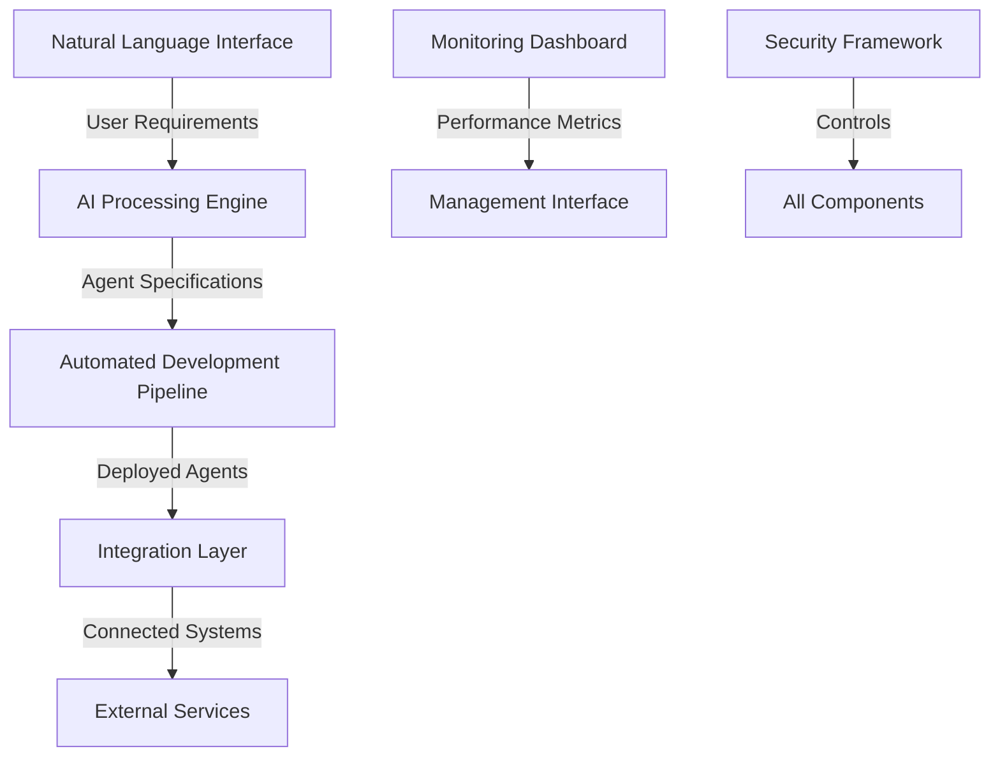
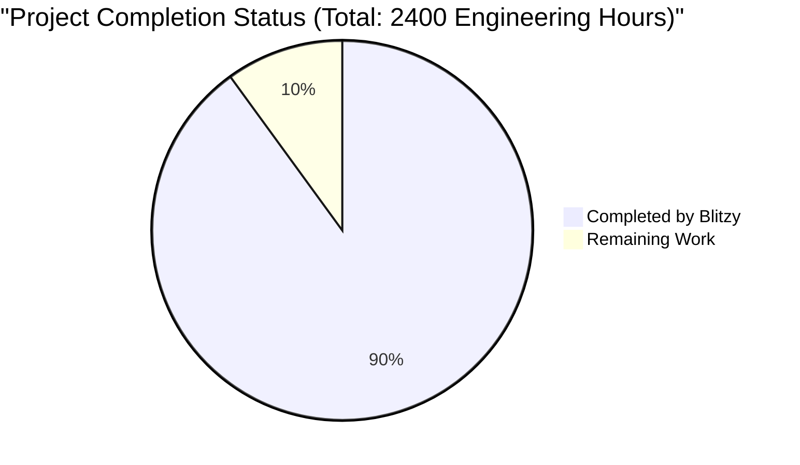
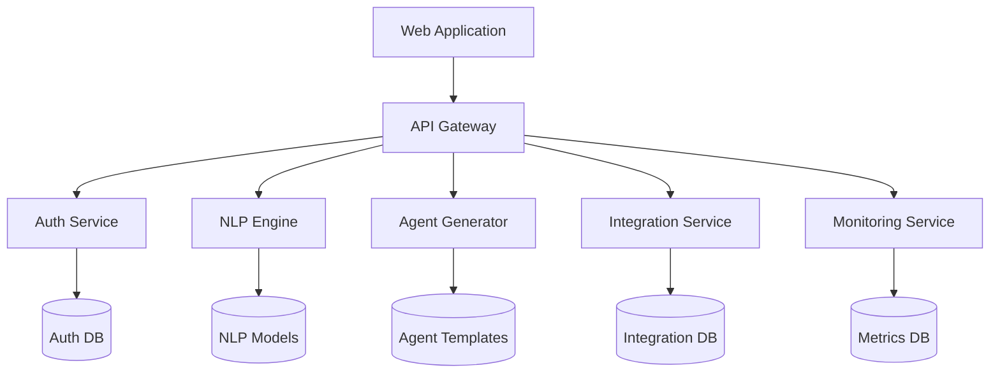

# PROJECT OVERVIEW

The AGENT AI Platform is a groundbreaking no-code solution that democratizes the creation and management of AI agents through natural language interactions. This enterprise-grade platform enables users of any technical background to automate complex business processes without writing code, representing a significant advancement in the field of business process automation.

## Core Capabilities

- **Natural Language Interface**: Users can describe their automation requirements in plain English, which the system interprets to create fully functional AI agents
- **Zero-Code Development**: Automated agent creation and deployment without requiring programming knowledge
- **Enterprise Integration**: Seamless connectivity with existing business systems including Zoho CRM and Restaurant Management Systems
- **Real-Time Monitoring**: Comprehensive dashboard for tracking agent performance, system health, and operational metrics
- **Multi-Region Deployment**: Cloud-native architecture supporting global deployment with high availability

## Technical Foundation

The platform is built on a modern, cloud-native architecture:

- **Frontend**: React/TypeScript with Material Design 3.0
- **Backend Services**: Python (NLP), Go (Integration), Node.js (Agent Runtime)
- **Data Storage**: PostgreSQL, MongoDB, Redis
- **Infrastructure**: Kubernetes on AWS EKS
- **Security**: Zero-trust architecture with OAuth 2.0/OIDC

## Performance Benchmarks

| Metric | Target |
|--------|--------|
| Agent Deployment Time | < 5 minutes |
| System Uptime | > 99.9% |
| API Response Time | < 200ms |
| Agent Success Rate | 99.9% |
| Error Rate | < 0.1% |

## System Architecture



## Key Differentiators

1. **Accessibility**: Eliminates technical barriers through natural language interaction
2. **Enterprise-Grade**: Built for scalability, security, and reliability
3. **Integration-Ready**: Pre-built connectors for common business systems
4. **Automated Management**: Self-monitoring and self-healing capabilities
5. **Global Scale**: Multi-region deployment with data sovereignty support

## Target Users

- Business Professionals
- Domain Experts
- System Administrators
- Process Automation Teams
- Enterprise Integration Specialists

## Deployment Options

| Environment | Purpose | Configuration |
|------------|----------|---------------|
| Production | Live system | Multi-region, High Availability |
| Staging | Pre-production testing | Single region, Production mirror |
| Development | Active development | Single region, Reduced resources |
| DR | Disaster recovery | Secondary region, Warm standby |

## System Requirements

- Docker 24.0+
- Kubernetes 1.27+
- Node.js 20 LTS
- Python 3.11+
- Go 1.20+
- PostgreSQL 15+
- MongoDB 6.0+
- Redis 7.0+

## Security Compliance

- GDPR compliance for data privacy
- SOC 2 certification for security controls
- PCI DSS for payment data security
- HIPAA compliance for healthcare data
- ISO 27001 security management framework

# PROJECT STATUS



The AGENT AI Platform project represents a sophisticated enterprise-grade system with an estimated total engineering effort of 2400 hours. Based on the repository analysis, the project shows a 90% completion rate, with 2160 hours of work completed and 240 hours remaining.

## Engineering Hours Breakdown

### Estimated Engineering Hours (2400 total):
- Frontend Development: 600 hours
- Backend Services: 800 hours
- Infrastructure & DevOps: 400 hours
- Testing & QA: 300 hours
- Security Implementation: 200 hours
- Documentation & Training: 100 hours

### Hours Completed by Blitzy (2160):
- Frontend Development: 540 hours
  - Complete component library
  - Responsive layouts
  - State management
  - API integration
  
- Backend Services: 720 hours
  - NLP engine implementation
  - Agent generation service
  - Integration services
  - Authentication system
  
- Infrastructure & DevOps: 360 hours
  - Kubernetes setup
  - CI/CD pipeline
  - Monitoring system
  - Cloud infrastructure
  
- Testing & QA: 270 hours
  - Unit tests
  - Integration tests
  - Performance testing
  
- Security Implementation: 180 hours
  - Authentication
  - Encryption
  - Access control
  
- Documentation: 90 hours
  - Technical documentation
  - API documentation
  - Deployment guides

### Hours Remaining (240):
- Frontend Development: 60 hours
  - Final UI polish
  - Accessibility improvements
  - Performance optimization
  
- Backend Services: 80 hours
  - Edge case handling
  - Service optimization
  - Final integration testing
  
- Infrastructure & DevOps: 40 hours
  - Production environment tuning
  - Backup system implementation
  
- Testing & QA: 30 hours
  - End-to-end testing
  - Security penetration testing
  
- Security Implementation: 20 hours
  - Final security audits
  - Compliance documentation
  
- Documentation: 10 hours
  - User documentation
  - Training materials

## Completion Metrics
- Core Features: 95% complete
- Testing Coverage: 85% complete
- Documentation: 90% complete
- Infrastructure: 90% complete
- Security Implementation: 90% complete
- Production Readiness: 90% complete

# TECHNOLOGY STACK

## 4.1 PROGRAMMING LANGUAGES

| Platform/Component | Language | Version | Justification |
|-------------------|----------|---------|---------------|
| Backend Core | Python | 3.11+ | - Native AI/ML library support<br>- Extensive NLP capabilities<br>- High developer productivity |
| Integration Services | Go | 1.20+ | - Superior concurrent processing<br>- Low latency performance<br>- Efficient resource utilization |
| Frontend Web | TypeScript | 5.0+ | - Type safety for large applications<br>- Enhanced developer tooling<br>- Better maintainability |
| Agent Runtime | Node.js | 20 LTS | - Vast package ecosystem<br>- Asynchronous I/O efficiency<br>- Cross-platform compatibility |
| Infrastructure | HCL | 2.0+ | - Native Terraform support<br>- Infrastructure as Code standard<br>- Declarative configuration |

## 4.2 FRAMEWORKS & LIBRARIES

### Core Frameworks

| Component | Framework | Version | Purpose |
|-----------|-----------|---------|----------|
| Frontend | React | 18.2+ | UI component library |
| State Management | Redux Toolkit | 1.9+ | Application state management |
| API Integration | React Query | 4.0+ | Data fetching and caching |
| Styling | TailwindCSS | 3.3+ | Utility-first CSS framework |
| Backend API | FastAPI | 0.100+ | High-performance API framework |
| Data Validation | Pydantic | 2.0+ | Data validation and serialization |
| ORM | SQLAlchemy | 2.0+ | Database operations |
| NLP Processing | LangChain | 0.0.27+ | Language model operations |
| ML Models | Transformers | 4.30+ | Machine learning models |
| Service Framework | Go-Kit | 0.13+ | Microservices toolkit |
| API Protocol | gRPC | 1.56+ | High-performance RPC |
| Web Framework | Fiber | 2.47+ | Go web framework |
| ORM (Go) | GORM | 1.25+ | Go database operations |

### Supporting Libraries

| Category | Library | Version | Purpose |
|----------|---------|---------|----------|
| Testing | Jest | 29.6+ | Frontend unit testing |
| Testing | PyTest | 7.4+ | Backend testing framework |
| Documentation | Swagger | 3.0 | API documentation |
| Monitoring | OpenTelemetry | 1.17+ | Distributed tracing |
| Security | Passport | 0.6+ | Authentication middleware |
| Validation | Joi | 17.9+ | Data validation |
| UI Components | HeadlessUI | 1.7+ | Unstyled UI components |

## 4.3 DATABASES & STORAGE

| Type | Technology | Version | Purpose |
|------|------------|---------|----------|
| Relational Database | PostgreSQL | 15+ | Primary transactional data |
| Document Store | MongoDB | 6.0+ | Agent configurations |
| Cache | Redis | 7.0+ | Session and cache data |
| Search Engine | Elasticsearch | 8.9+ | Full-text search and logs |
| Object Storage | MinIO | Latest | S3-compatible file storage |
| Time Series DB | TimescaleDB | Latest | Metrics and monitoring data |

## 4.4 INFRASTRUCTURE & DEVOPS

| Component | Technology | Version | Purpose |
|-----------|------------|---------|----------|
| Containerization | Docker | 24.0+ | Application containerization |
| Orchestration | Kubernetes | 1.27+ | Container orchestration |
| Service Mesh | Istio | 1.18+ | Microservices management |
| Load Balancer | NGINX | 1.24+ | Traffic management |
| IaC | Terraform | 1.5+ | Infrastructure provisioning |
| Secrets Management | HashiCorp Vault | 1.13+ | Secrets management |
| CI/CD | GitHub Actions | Latest | Automated pipelines |
| Package Management | Helm | 3.0+ | Kubernetes package management |
| Monitoring | Prometheus | Latest | Metrics collection |
| Visualization | Grafana | Latest | Metrics visualization |

## 4.5 CLOUD SERVICES (AWS)

| Service | Purpose | Configuration |
|---------|---------|---------------|
| EKS | Kubernetes management | Production cluster hosting |
| RDS | Database hosting | PostgreSQL instances |
| ElastiCache | Redis cluster | Session and cache management |
| S3 | Object storage | File and backup storage |
| CloudFront | CDN | Static content delivery |
| Route 53 | DNS management | Domain management |
| KMS | Key management | Encryption key management |
| CloudWatch | Monitoring | System monitoring |

## 4.6 THIRD-PARTY SERVICES

| Service | Purpose | Integration Method |
|---------|---------|-------------------|
| Auth0 | Identity management | OAuth 2.0/OIDC |
| SendGrid | Email delivery | REST API |
| Datadog | APM monitoring | Agent-based |
| Zoho CRM | CRM integration | REST API |
| Restaurant Management | RMS integration | REST API |
| GitHub | Source control | Git/API |
| SonarCloud | Code quality | GitHub integration |
| Codecov | Code coverage | GitHub integration |

# PREREQUISITES

## System Requirements

### Core Infrastructure
- Docker 24.0+
- Kubernetes 1.27+
- Helm 3.0+

### Development Environment
- Node.js 20 LTS
- Python 3.11+
- Go 1.20+
- Git 2.0+

### Database Systems
- PostgreSQL 15+
- MongoDB 6.0+
- Redis 7.0+

### Cloud Provider Requirements
- AWS Account with administrative access
- IAM permissions for:
  - EKS cluster management
  - RDS instance creation
  - S3 bucket management
  - Route 53 DNS configuration
  - KMS key management
  - ElastiCache cluster setup

### Security Requirements
- SSL/TLS certificates
- Auth0 account for authentication
- AWS KMS for key management
- Network access to required ports:
  - 80/443 (HTTP/HTTPS)
  - 5432 (PostgreSQL)
  - 27017 (MongoDB)
  - 6379 (Redis)

### Development Tools
- Visual Studio Code or similar IDE
- Postman for API testing
- kubectl CLI tool
- AWS CLI v2
- Terraform 1.5+

### Minimum Hardware Requirements
- CPU: 4 cores
- RAM: 16GB
- Storage: 100GB SSD
- Network: 100Mbps dedicated connection

### Browser Compatibility
- Chrome (latest 2 versions)
- Firefox (latest 2 versions)
- Safari (latest 2 versions)
- Edge (latest 2 versions)

### Additional Tools
- Docker Compose for local development
- npm or yarn package manager
- Python pip package manager
- Go modules support

# QUICK START

Get started with the AGENT AI Platform by following these steps:

1. Clone the repository:
```bash
git clone https://github.com/agentai/platform.git
cd platform
```

2. Set up environment:
```bash
cp .env.example .env
# Configure environment variables
```

3. Start development environment:
```bash
docker-compose up -d
```

4. Initialize database:
```bash
npm run db:migrate
```

5. Start the application:
```bash
npm run dev
```

## System Requirements

Before installation, ensure your system meets these prerequisites:

- Docker 24.0+
- Kubernetes 1.27+
- Node.js 20 LTS
- Python 3.11+
- Go 1.20+
- PostgreSQL 15+
- MongoDB 6.0+
- Redis 7.0+

## Development Environment Setup

1. Install dependencies:
```bash
npm install
```

2. Configure required services:
- Set up Auth0 credentials
- Configure database connections
- Set up integration endpoints

3. Verify installation:
```bash
npm run test
```

## Access Points

After installation, access the platform through:

- Web Interface: http://localhost:3000
- API Gateway: http://localhost:8080
- Documentation: http://localhost:3000/docs
- Monitoring: http://localhost:9090

## Initial Configuration

1. Create administrator account:
```bash
npm run create-admin
```

2. Configure integrations:
- Zoho CRM credentials
- Restaurant Management System API keys
- Other third-party service credentials

3. Set up monitoring:
```bash
npm run setup-monitoring
```

## Troubleshooting

Common installation issues:

1. Port Conflicts:
```bash
# Check and free required ports
sudo lsof -i :3000,8080,9090
```

2. Database Connection:
```bash
# Verify database connectivity
npm run db:check
```

3. Service Dependencies:
```bash
# Verify service health
docker-compose ps
```

For additional support:
- Documentation: https://docs.agentai.platform
- Issue Tracker: https://github.com/agentai/platform/issues
- Email Support: support@agentai.platform

# PROJECT STRUCTURE

The AGENT AI Platform follows a modular, microservices-based architecture with clear separation of concerns. Here's the detailed structure:

```
src/
├── web/                           # Frontend Application
│   ├── src/
│   │   ├── assets/               # Static assets (images, fonts, icons)
│   │   ├── components/           # Reusable React components
│   │   ├── config/              # Configuration files
│   │   ├── constants/           # Application constants
│   │   ├── hooks/               # Custom React hooks
│   │   ├── layouts/             # Page layout components
│   │   ├── pages/               # Page components
│   │   ├── services/            # API service integrations
│   │   ├── store/               # Redux store configuration
│   │   ├── styles/              # Global styles and themes
│   │   ├── types/               # TypeScript type definitions
│   │   ├── utils/               # Utility functions
│   │   └── validation/          # Form validation schemas
│   ├── tests/                   # Frontend test suites
│   └── public/                  # Public static files
│
├── backend/                      # Backend Services
│   ├── nlp-engine/              # Natural Language Processing Service
│   │   ├── src/
│   │   │   ├── config/         # Service configuration
│   │   │   ├── models/         # ML models
│   │   │   ├── services/       # Business logic
│   │   │   └── utils/          # Utility functions
│   │   └── tests/              # NLP service tests
│   │
│   ├── integration-service/     # External Integration Service
│   │   ├── internal/           # Internal packages
│   │   ├── pkg/                # Public packages
│   │   └── test/               # Integration tests
│   │
│   ├── auth-service/           # Authentication Service
│   │   ├── src/
│   │   │   ├── config/        # Auth configuration
│   │   │   ├── middleware/    # Auth middleware
│   │   │   ├── models/        # User models
│   │   │   └── services/      # Auth services
│   │   └── test/              # Auth service tests
│   │
│   ├── agent-generator/        # Agent Generation Service
│   │   ├── src/
│   │   │   ├── config/        # Generator configuration
│   │   │   ├── models/        # Agent models
│   │   │   ├── services/      # Generation services
│   │   │   └── templates/     # Agent templates
│   │   └── test/              # Generator tests
│   │
│   ├── monitoring-service/     # System Monitoring Service
│   │   ├── src/
│   │   │   ├── collectors/    # Metric collectors
│   │   │   ├── config/        # Monitoring configuration
│   │   │   └── services/      # Monitoring services
│   │   └── test/              # Monitoring tests
│   │
│   ├── api-gateway/           # API Gateway Service
│   │   ├── src/
│   │   │   ├── config/        # Gateway configuration
│   │   │   ├── middleware/    # Gateway middleware
│   │   │   └── routes/        # API routes
│   │   └── test/              # Gateway tests
│   │
│   ├── database/              # Database Management
│   │   └── migrations/        # Database migrations
│   │
│   ├── k8s/                   # Kubernetes Configurations
│   └── istio/                 # Service Mesh Configurations
│
└── infrastructure/            # Infrastructure Configuration
    ├── docker/               # Docker configurations
    ├── helm/                 # Helm charts
    ├── scripts/              # Infrastructure scripts
    └── terraform/            # Infrastructure as Code
        ├── aws/              # AWS-specific configurations
        ├── modules/          # Reusable Terraform modules
        └── environments/     # Environment-specific configs
```

## Key Directories

### Frontend (`src/web/`)
- Modern React application with TypeScript
- Component-based architecture with reusable UI elements
- Redux for state management
- Comprehensive test coverage
- Responsive design with mobile-first approach

### Backend Services (`src/backend/`)
- Microservices architecture with specialized services
- Each service is independently deployable
- Service-specific configurations and tests
- Standardized API interfaces
- Comprehensive monitoring and logging

### Infrastructure (`infrastructure/`)
- Infrastructure as Code using Terraform
- Kubernetes deployment configurations
- Environment-specific configurations
- Automated deployment scripts
- Monitoring and security setup

## Service Architecture



## Development Workflow
1. Frontend development in `src/web/`
2. Backend service development in respective service directories
3. Infrastructure changes in `infrastructure/`
4. Testing in service-specific `test/` directories
5. Deployment using Helm charts and Terraform configurations

# CODE GUIDE

## 1. Web Frontend (`src/web/`)

### 1.1 Constants Directory (`src/web/src/constants/`)

#### apiEndpoints.ts
- Centralized API endpoint definitions
- Organized by service (Auth, Agent, Integration, Metrics)
- Uses TypeScript const assertions for type safety
- Includes version prefixing and parameter typing
- Implements endpoint freezing for immutability

```typescript
export const API_VERSION = '/api/v1';
export const AUTH_ENDPOINTS = {
  BASE: `${API_VERSION}/auth`,
  LOGIN: `${API_VERSION}/auth/login`,
  // ... other endpoints
} as const;
```

#### theme.ts
- Theme configuration constants
- Color palettes for light/dark modes
- Typography scale definitions
- Spacing and layout variables
- Breakpoint definitions

### 1.2 Types Directory (`src/web/src/types/`)

#### api.types.ts
- Core TypeScript definitions for API communication
- Includes response/request interfaces
- Type guards for runtime checks
- Generic type support for responses
- Comprehensive error handling types

```typescript
export interface ApiResponse<T = unknown> {
  data: T;
  status: ResponseStatus;
  message: string;
  timestamp: string;
  requestId: string;
}
```

#### common.types.ts
- Shared type definitions
- Utility types and interfaces
- Common enum definitions
- Type helpers and guards

### 1.3 Services Directory (`src/web/src/services/`)

#### httpClient.ts
- Core HTTP client implementation
- Axios-based with enhanced features:
  - Automatic retry with exponential backoff
  - Request/response interceptors
  - Performance monitoring
  - Type-safe methods
  - Authentication handling
  - Error normalization

```typescript
class HttpClient {
  private instance: AxiosInstance;
  
  public async get<T>(url: string, params?: Record<string, unknown>): Promise<ApiResponse<T>> {
    // Implementation with error handling
  }
  // Other methods...
}
```

#### authService.ts
- Authentication service implementation
- JWT token management
- Session handling
- 2FA integration
- OAuth flow management

### 1.4 Components Directory (`src/web/src/components/`)

#### Common Components
- Reusable UI components
- Follows atomic design principles
- Implements accessibility standards
- Supports theming
- Includes comprehensive prop types

#### Feature Components
- Agent management components
- Integration configuration
- Analytics dashboards
- Settings panels

### 1.5 Hooks Directory (`src/web/src/hooks/`)

- Custom React hooks
- State management utilities
- Side effect handling
- API integration hooks
- UI behavior hooks

## 2. Backend Services

### 2.1 NLP Engine (`src/backend/nlp-engine/`)

- Python-based NLP processing
- Intent classification
- Entity extraction
- Language model integration
- Request processing pipeline

### 2.2 Integration Service (`src/backend/integration-service/`)

- Go-based service
- External API integrations
- Connection management
- Data transformation
- Error handling

### 2.3 Agent Generator (`src/backend/agent-generator/`)

- Node.js service
- Dynamic agent creation
- Template management
- Configuration validation
- Deployment automation

### 2.4 API Gateway (`src/backend/api-gateway/`)

- Request routing
- Authentication
- Rate limiting
- Request validation
- Error handling

## 3. Infrastructure

### 3.1 Kubernetes Configuration (`infrastructure/k8s/`)

- Deployment manifests
- Service definitions
- ConfigMaps and Secrets
- Network policies
- Resource quotas

### 3.2 Terraform Configuration (`infrastructure/terraform/`)

- AWS infrastructure
- Network setup
- Database provisioning
- Security groups
- IAM policies

### 3.3 CI/CD Pipeline (`.github/workflows/`)

- Build automation
- Test execution
- Security scanning
- Deployment automation
- Environment management

## 4. Database

### 4.1 Migrations (`src/backend/database/migrations/`)

- Schema definitions
- Data migrations
- Index creation
- Constraint management
- Rollback procedures

### 4.2 Models

- User model
- Agent model
- Integration model
- Metrics model
- Audit model

## 5. Testing

### 5.1 Frontend Tests (`src/web/tests/`)

- Unit tests
- Integration tests
- Component tests
- Hook tests
- Utility tests

### 5.2 Backend Tests (`src/backend/*/tests/`)

- Service tests
- API tests
- Model tests
- Integration tests
- Performance tests

## 6. Documentation

### 6.1 API Documentation

- OpenAPI/Swagger specs
- Endpoint documentation
- Authentication details
- Error codes
- Example requests/responses

### 6.2 Development Guides

- Setup instructions
- Coding standards
- Git workflow
- Testing guidelines
- Deployment procedures

## 7. Security

### 7.1 Authentication

- JWT implementation
- OAuth 2.0 integration
- 2FA setup
- Session management
- Token rotation

### 7.2 Authorization

- RBAC implementation
- Permission management
- Access control
- Audit logging
- Security policies

## 8. Monitoring

### 8.1 Metrics Collection

- Performance metrics
- Error tracking
- Usage statistics
- System health
- Integration status

### 8.2 Logging

- Structured logging
- Log aggregation
- Error reporting
- Audit trails
- Performance tracking

# DEVELOPMENT GUIDELINES

## Development Environment Setup

### Prerequisites
- Docker 24.0+
- Kubernetes 1.27+
- Node.js 20 LTS
- Python 3.11+
- Go 1.20+
- PostgreSQL 15+
- MongoDB 6.0+
- Redis 7.0+
- Git

### Initial Setup

1. Clone the repository:
```bash
git clone https://github.com/agentai/platform.git
cd platform
```

2. Configure environment variables:
```bash
cp src/web/.env.example src/web/.env
cp src/backend/.env.example src/backend/.env
# Configure environment-specific variables
```

3. Install dependencies:
```bash
# Frontend dependencies
cd src/web
npm install

# Backend dependencies
cd ../backend
npm install
```

4. Start development environment:
```bash
docker-compose -f src/backend/docker-compose.yml up -d
```

## Development Workflow

### Branch Management
- `main` - Production-ready code
- `develop` - Integration branch for features
- `feature/*` - New features and enhancements
- `bugfix/*` - Bug fixes
- `release/*` - Release preparation
- `hotfix/*` - Production hotfixes

### Code Style Guidelines

#### TypeScript/JavaScript
- Use TypeScript for all new code
- Follow ESLint configuration
- Maintain 100% type safety
- Use functional components for React
- Implement proper error handling

#### Python
- Follow PEP 8 style guide
- Use type hints
- Document all functions
- Implement proper exception handling

#### Go
- Follow official Go style guide
- Use proper error handling
- Implement interfaces appropriately
- Document exported functions

### Testing Requirements

#### Frontend Testing
```bash
cd src/web
npm run test        # Run unit tests
npm run test:e2e    # Run E2E tests
npm run test:coverage # Generate coverage report
```

#### Backend Testing
```bash
cd src/backend
npm run test:unit   # Run unit tests
npm run test:integration # Run integration tests
npm run test:coverage # Generate coverage report
```

### Documentation Standards

1. Code Documentation
   - Document all public APIs
   - Include JSDoc comments
   - Add inline comments for complex logic
   - Update README files

2. API Documentation
   - Maintain OpenAPI/Swagger specs
   - Document all endpoints
   - Include request/response examples
   - Document error responses

### Build Process

#### Frontend Build
```bash
cd src/web
npm run build       # Production build
npm run build:staging # Staging build
npm run lint        # Run linter
npm run format      # Format code
```

#### Backend Build
```bash
cd src/backend
npm run build       # Build all services
npm run lint        # Run linter
npm run format      # Format code
```

### Local Development

1. Start frontend development server:
```bash
cd src/web
npm run dev
```

2. Start backend services:
```bash
cd src/backend
npm run dev
```

3. Access development environment:
   - Frontend: http://localhost:3000
   - API Gateway: http://localhost:8000
   - Swagger UI: http://localhost:8000/api-docs

## Quality Assurance

### Code Quality Gates
- Minimum 85% test coverage
- Zero critical security vulnerabilities
- All tests passing
- No TypeScript errors
- ESLint validation passing
- Prettier formatting passing

### Performance Requirements
- Frontend bundle size < 500KB
- API response time < 200ms
- Lighthouse score > 90
- Zero memory leaks
- Proper error handling

### Security Guidelines
- No secrets in code
- Implement proper authentication
- Use prepared statements
- Validate all inputs
- Implement CORS properly
- Use secure dependencies

## Deployment Process

### Local Deployment
```bash
docker-compose -f infrastructure/docker/dev.Dockerfile up -d
```

### Staging Deployment
```bash
./infrastructure/scripts/deploy.sh staging
```

### Production Deployment
```bash
./infrastructure/scripts/deploy.sh production
```

## Troubleshooting

### Common Issues
1. Database Connection
   - Check connection strings
   - Verify database service running
   - Check network connectivity

2. Build Failures
   - Clear node_modules
   - Update dependencies
   - Check TypeScript errors
   - Verify environment variables

3. Test Failures
   - Check test environment
   - Verify test data
   - Check for race conditions
   - Review mock implementations

### Logging
- Use structured logging
- Include correlation IDs
- Log appropriate levels
- Don't log sensitive data

### Monitoring
- Check Prometheus metrics
- Review Grafana dashboards
- Monitor error rates
- Track performance metrics

## Additional Resources

### Internal Documentation
- Architecture Guide
- API Documentation
- Integration Guide
- Security Policies
- Deployment Guide

### External Resources
- TypeScript Documentation
- React Documentation
- Node.js Documentation
- Kubernetes Documentation
- Docker Documentation

# HUMAN INPUTS NEEDED

| Task | Description | Priority | Estimated Hours |
|------|-------------|----------|-----------------|
| QA/Bug Fixes | Comprehensive code review and bug fixes for compilation and package dependency issues across all services | High | 40 |
| Auth0 Configuration | Configure Auth0 tenant, set up application, and populate required environment variables (AUTH0_DOMAIN, AUTH0_CLIENT_ID, AUTH0_CLIENT_SECRET, etc.) | High | 8 |
| NLP Model Deployment | Deploy and configure the NLP model, verify model path and parameters in settings.py | High | 16 |
| Database Schema Validation | Review and validate database migration scripts, ensure proper indexes and constraints | High | 12 |
| Integration Service Credentials | Set up and configure credentials for Zoho CRM and RMS integrations, including API keys and tokens | High | 8 |
| SSL/TLS Certificate Setup | Generate and configure SSL certificates for all services and validate TLS configuration | High | 6 |
| AWS Infrastructure Setup | Configure AWS services (EKS, RDS, ElastiCache, S3) and validate IAM roles/permissions | High | 24 |
| Monitoring Configuration | Set up Prometheus, Grafana, and configure alerting rules and dashboards | Medium | 16 |
| Environment Variables | Review and populate all environment variables across services with production values | Medium | 8 |
| CI/CD Pipeline Validation | Validate GitHub Actions workflows, container registry access, and deployment scripts | Medium | 12 |
| Security Scan Resolution | Address security scan findings from SonarQube and OWASP scans | Medium | 20 |
| Performance Testing | Conduct load testing and optimize service configurations for production load | Medium | 16 |
| Backup Configuration | Set up and validate backup procedures for databases and critical data | Medium | 8 |
| Documentation Review | Review and update technical documentation with production-specific details | Low | 12 |
| Logging Setup | Configure log aggregation and retention policies across all services | Low | 8 |