# Technical Specifications

# 1. INTRODUCTION

## 1.1 EXECUTIVE SUMMARY

The AGENT AI Platform represents a transformative no-code solution that democratizes the creation and management of AI agents through natural language interactions. By enabling users of any technical background to automate complex business processes without writing code, the platform addresses the critical challenge of specialized agent development and management. The system interprets natural language descriptions to autonomously propose, build, integrate, and manage necessary agents, delivering immediate value to business professionals, domain experts, and system administrators.

The platform specifically targets the elimination of manual, technical processes in agent development while ensuring enterprise-grade security, scalability, and integration capabilities. This approach significantly reduces time-to-value for business process automation initiatives while maintaining high standards of reliability and performance.

## 1.2 SYSTEM OVERVIEW

### Project Context

| Aspect | Description |
|--------|-------------|
| Market Position | First-to-market no-code AI agent platform with natural language interface |
| Target Market | Business professionals, domain experts, and organizations requiring process automation |
| Enterprise Integration | Seamless integration with existing business systems and workflows |
| Competitive Advantage | Elimination of technical barriers through natural language interaction |

### High-Level Description

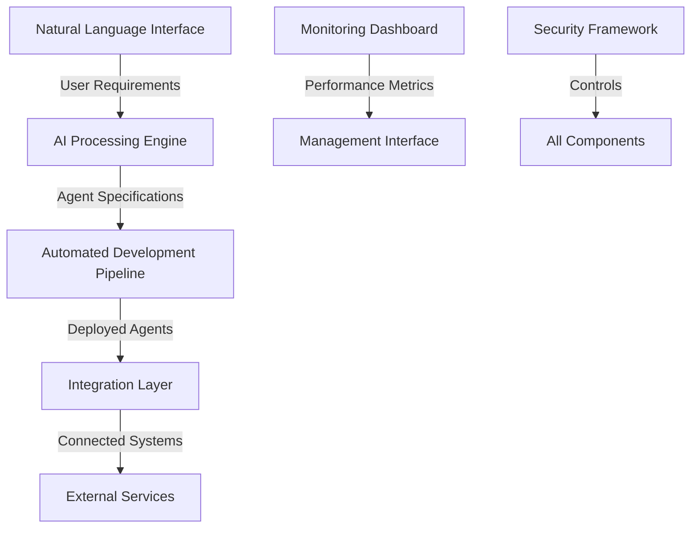

### Success Criteria

| Category | Metrics |
|----------|---------|
| Performance | - Agent deployment time < 5 minutes<br>- System uptime > 99.9%<br>- API response time < 200ms |
| Adoption | - 80% user satisfaction rate<br>- 50% reduction in automation development time |
| Business Impact | - 40% reduction in operational costs<br>- 70% faster time-to-market for automations |
| Technical Quality | - 99.9% agent execution success rate<br>- < 0.1% error rate in generated code |

## 1.3 SCOPE

### In-Scope Elements

#### Core Features and Functionalities

| Component | Capabilities |
|-----------|-------------|
| Natural Language Processing | - User requirement interpretation<br>- Context understanding<br>- Intent mapping |
| Agent Generation | - Automated code generation<br>- Environment configuration<br>- Deployment automation |
| Integration Framework | - API connectivity<br>- Data transformation<br>- Authentication management |
| Monitoring System | - Performance tracking<br>- Error detection<br>- Usage analytics |

#### Implementation Boundaries

| Boundary Type | Coverage |
|--------------|-----------|
| System | - Web-based interface<br>- Cloud infrastructure<br>- Integration endpoints |
| User Groups | - Business professionals<br>- Domain experts<br>- System administrators |
| Geographic | - Global deployment<br>- Multi-region support<br>- Language: English |
| Data Domains | - Business process data<br>- Integration metadata<br>- Performance metrics |

### Out-of-Scope Elements

- Custom hardware requirements or specifications
- Physical infrastructure setup and maintenance
- End-user training program development
- Legacy system migration services
- Manual coding interfaces or development environments
- Custom hardware integrations
- Offline mode operations
- Third-party plugin development
- Historical data migration
- Custom security protocols beyond standard requirements

# 2. SYSTEM ARCHITECTURE

## 2.1 High-Level Architecture

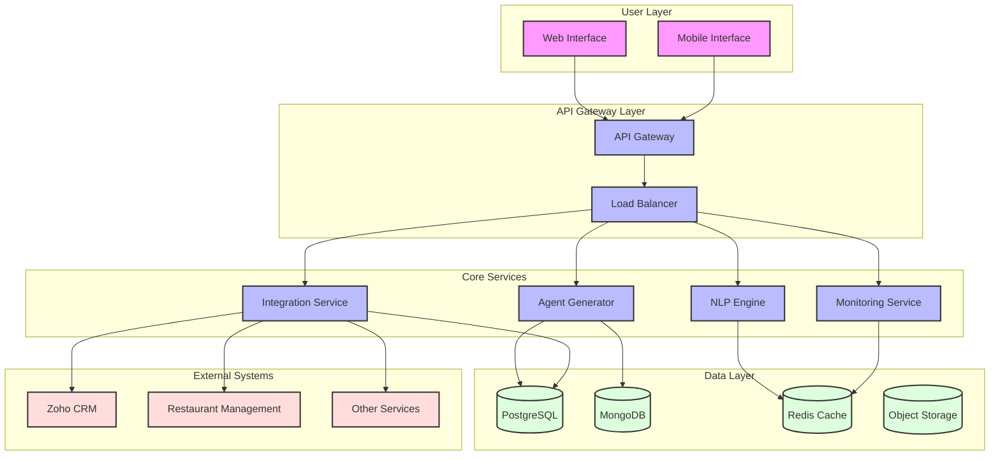

## 2.2 Component Details

| Component | Purpose | Technology Stack | Interfaces | Data Storage | Scaling Strategy |
|-----------|---------|-----------------|------------|--------------|------------------|
| NLP Engine | Process natural language inputs | Python, TensorFlow | REST API, gRPC | Redis for caching | Horizontal with stateless instances |
| Agent Generator | Create and deploy agents | Node.js, Docker | REST API | PostgreSQL, MongoDB | Horizontal with job queue |
| Integration Service | Manage external connections | Go | REST API, WebSocket | PostgreSQL | Horizontal per integration type |
| Monitoring Service | System telemetry | Prometheus, Grafana | REST API, WebSocket | TimescaleDB | Vertical for storage, horizontal for collectors |

## 2.3 Technical Decisions

### Architecture Style
- Microservices architecture chosen for:
  - Independent scaling of components
  - Technology flexibility per service
  - Isolation of failures
  - Easier maintenance and updates

### Communication Patterns

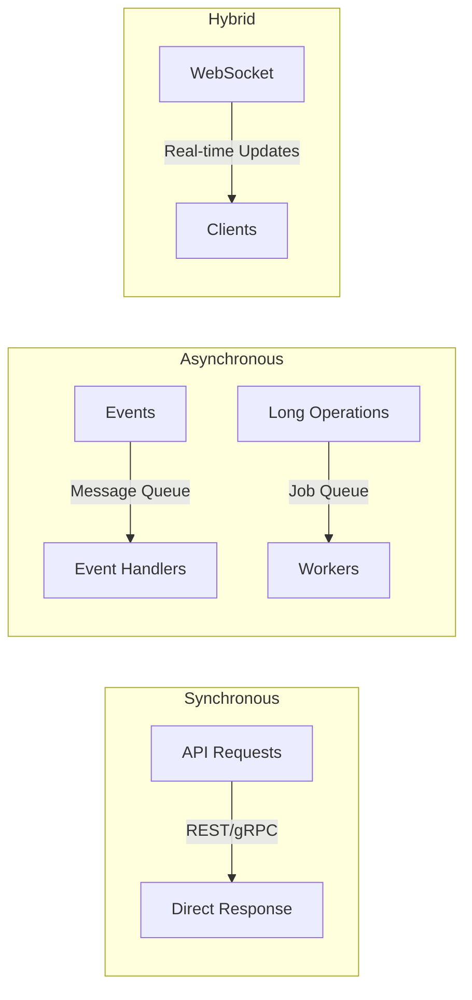

### Data Storage Solutions

| Data Type | Storage Solution | Justification |
|-----------|-----------------|---------------|
| Transactional | PostgreSQL | ACID compliance, relational integrity |
| Configuration | MongoDB | Schema flexibility, document structure |
| Cache | Redis | In-memory performance, pub/sub support |
| Files | S3-compatible | Scalable object storage, CDN integration |

## 2.4 Cross-Cutting Concerns

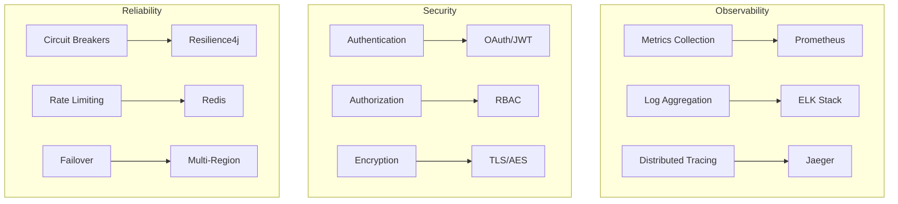

## 2.5 System Views

### Container Diagram

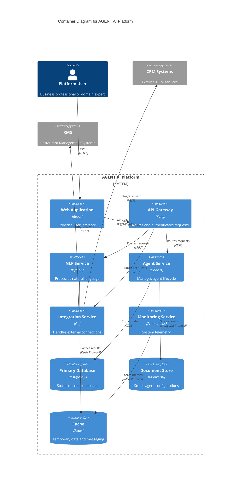

### Deployment Diagram

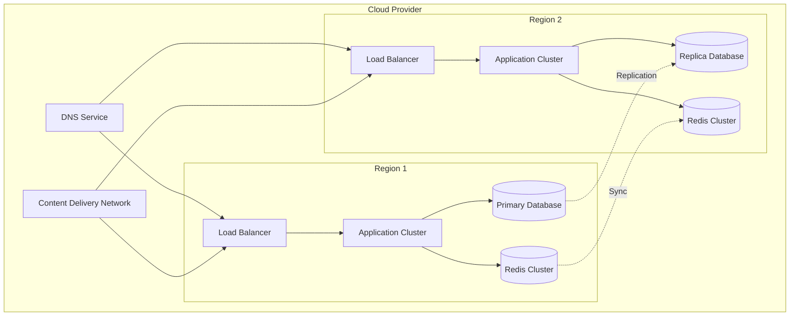

# 3. SYSTEM COMPONENTS ARCHITECTURE

## 3.1 USER INTERFACE DESIGN

### 3.1.1 Design Specifications

| Category | Requirements |
|----------|--------------|
| Visual Hierarchy | - F-pattern layout for web interfaces<br>- Z-pattern for mobile interfaces<br>- Maximum 3 levels of information hierarchy |
| Component Library | - Material Design 3.0 based system<br>- Custom themed components<br>- Reusable pattern library |
| Responsive Design | - Breakpoints: 320px, 768px, 1024px, 1440px<br>- Mobile-first approach<br>- Fluid typography (16px-20px base) |
| Accessibility | - WCAG 2.1 Level AA compliance<br>- ARIA labels for all interactive elements<br>- Keyboard navigation support |
| Device Support | - Modern browsers (last 2 versions)<br>- iOS 14+<br>- Android 10+<br>- Desktop Windows/Mac/Linux |
| Theming | - System-default theme detection<br>- Light/Dark mode toggle<br>- Custom brand theming support |
| i18n/l10n | - RTL layout support<br>- Unicode character handling<br>- Language selection persistence |

### 3.1.2 Interface Elements

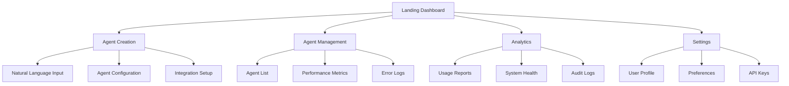

### 3.1.3 Critical User Flows

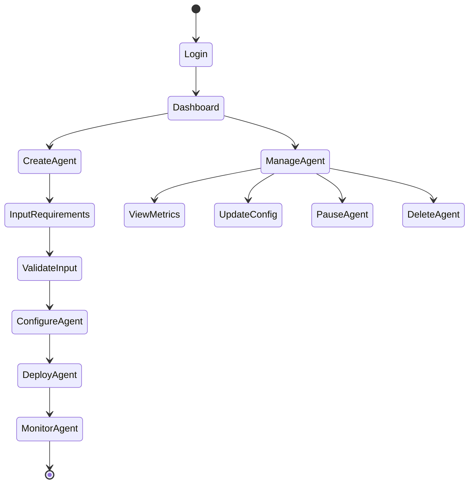

## 3.2 DATABASE DESIGN

### 3.2.1 Schema Design

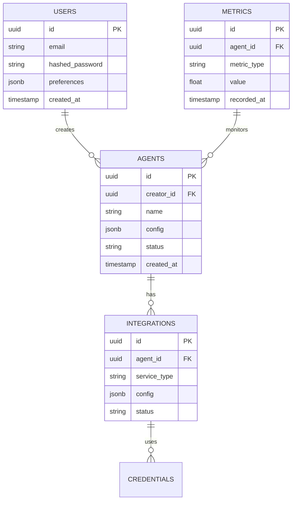

### 3.2.2 Data Management Strategy

| Aspect | Implementation |
|--------|---------------|
| Partitioning | - Time-based partitioning for metrics<br>- Hash partitioning for users<br>- Range partitioning for agents |
| Indexing | - B-tree indexes for primary keys<br>- GiST indexes for JSON fields<br>- Partial indexes for active records |
| Archival | - 90-day retention for metrics<br>- 12-month retention for logs<br>- Archived data moved to cold storage |
| Backup | - Hourly incremental backups<br>- Daily full backups<br>- 30-day retention period |
| Security | - Row-level security enabled<br>- Encrypted at rest (AES-256)<br>- Audit logging for all changes |

## 3.3 API DESIGN

### 3.3.1 API Architecture

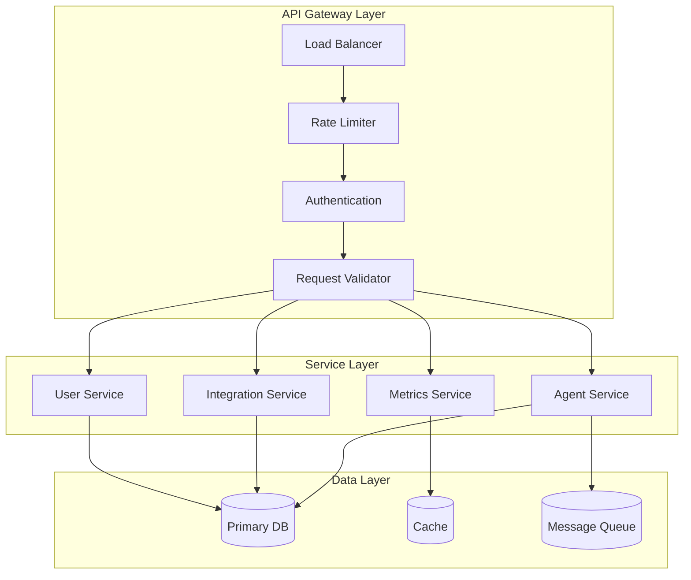

### 3.3.2 API Specifications

| Endpoint Category | Methods | Rate Limit | Authentication |
|------------------|---------|------------|----------------|
| /agents | GET, POST, PUT, DELETE | 100/min | JWT + API Key |
| /integrations | GET, POST, PUT | 60/min | JWT + API Key |
| /metrics | GET | 200/min | JWT |
| /users | GET, PUT | 30/min | JWT + 2FA |

### 3.3.3 Integration Patterns

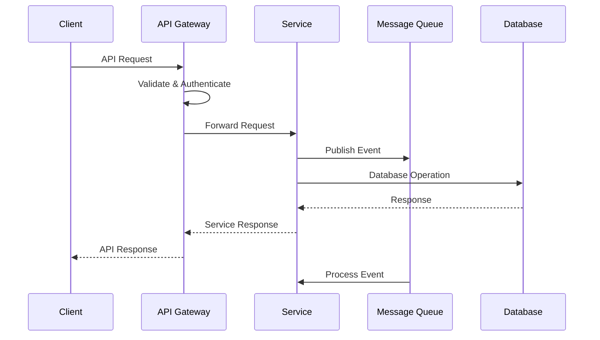

# 4. TECHNOLOGY STACK

## 4.1 PROGRAMMING LANGUAGES

| Platform/Component | Language | Version | Justification |
|-------------------|----------|---------|---------------|
| Backend Core | Python | 3.11+ | - Native AI/ML library support<br>- Extensive NLP capabilities<br>- High developer productivity |
| Integration Services | Go | 1.20+ | - Superior concurrent processing<br>- Low latency performance<br>- Efficient resource utilization |
| Frontend Web | TypeScript | 5.0+ | - Type safety for large applications<br>- Enhanced developer tooling<br>- Better maintainability |
| Agent Runtime | Node.js | 20 LTS | - Vast package ecosystem<br>- Asynchronous I/O efficiency<br>- Cross-platform compatibility |
| Infrastructure | HCL | 2.0+ | - Native Terraform support<br>- Infrastructure as Code standard<br>- Declarative configuration |

## 4.2 FRAMEWORKS & LIBRARIES

### Core Frameworks

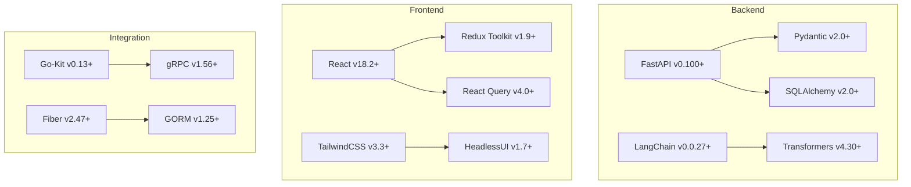

### Supporting Libraries

| Category | Library | Version | Purpose |
|----------|---------|---------|----------|
| Testing | Jest | 29.6+ | Frontend unit testing |
| Testing | PyTest | 7.4+ | Backend testing framework |
| Documentation | Swagger | 3.0 | API documentation |
| Monitoring | OpenTelemetry | 1.17+ | Distributed tracing |
| Security | Passport | 0.6+ | Authentication middleware |
| Validation | Joi | 17.9+ | Data validation |

## 4.3 DATABASES & STORAGE

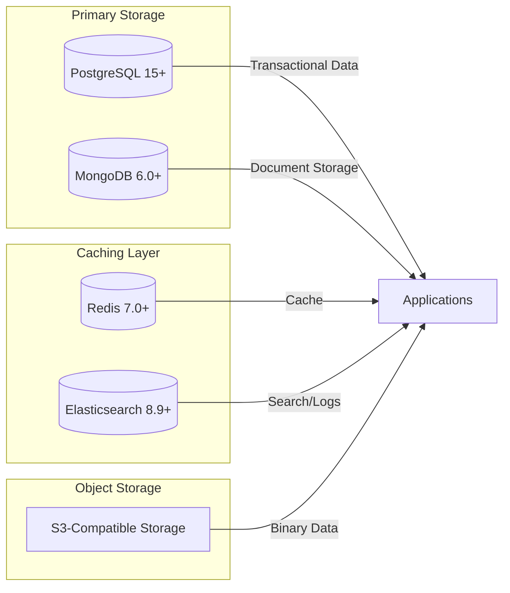

### Storage Strategy

| Data Type | Storage Solution | Justification |
|-----------|-----------------|---------------|
| Transactional | PostgreSQL | ACID compliance, relational integrity |
| Configuration | MongoDB | Schema flexibility, JSON support |
| Cache | Redis | In-memory performance, pub/sub |
| Search | Elasticsearch | Full-text search, log aggregation |
| Files | MinIO | S3-compatible, self-hosted option |

## 4.4 THIRD-PARTY SERVICES

| Category | Service | Purpose | Integration Method |
|----------|---------|---------|-------------------|
| Authentication | Auth0 | Identity management | OAuth 2.0/OIDC |
| Email | SendGrid | Transactional email | REST API |
| Monitoring | Datadog | System monitoring | Agent-based |
| CI/CD | GitHub Actions | Pipeline automation | YAML configuration |
| Cloud | AWS | Infrastructure | AWS SDK |
| CRM | Zoho | Business integration | REST API |

## 4.5 DEVELOPMENT & DEPLOYMENT

### Development Pipeline

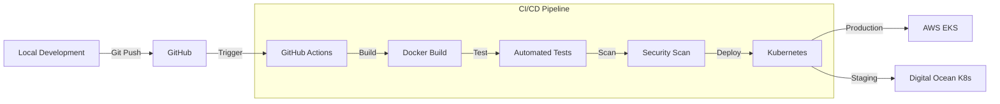

### Infrastructure Components

| Component | Technology | Version | Purpose |
|-----------|------------|---------|----------|
| Container Runtime | Docker | 24.0+ | Application containerization |
| Orchestration | Kubernetes | 1.27+ | Container orchestration |
| Service Mesh | Istio | 1.18+ | Microservices management |
| Load Balancer | NGINX | 1.24+ | Traffic management |
| IaC | Terraform | 1.5+ | Infrastructure provisioning |
| Secrets | HashiCorp Vault | 1.13+ | Secrets management |

# 5. SYSTEM DESIGN

## 5.1 USER INTERFACE DESIGN

### 5.1.1 Layout Structure

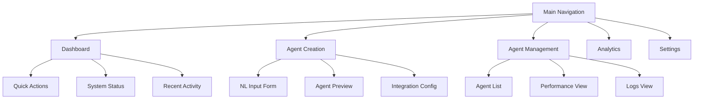

### 5.1.2 Component Specifications

| Component | Description | Interactions |
|-----------|-------------|--------------|
| Natural Language Input | Multi-line text area with context-aware suggestions | Real-time validation, auto-complete |
| Agent Preview | Split-view showing configuration and live preview | Interactive parameter adjustment |
| Integration Panel | Card-based interface for connection management | Drag-drop configuration, status indicators |
| Performance Dashboard | Grid layout with real-time metrics and charts | Filterable, exportable data views |
| Settings Console | Tabbed interface for system configuration | Form-based input with validation |

### 5.1.3 Responsive Breakpoints

| Breakpoint | Screen Width | Layout Adjustments |
|------------|--------------|-------------------|
| Desktop | ≥1200px | Full feature set, multi-column layout |
| Tablet | ≥768px | Condensed navigation, stacked panels |
| Mobile | ≥320px | Single column, collapsible sections |

## 5.2 DATABASE DESIGN

### 5.2.1 Schema Structure


### 5.2.2 Storage Strategy

| Data Type | Storage Solution | Justification |
|-----------|-----------------|---------------|
| User Data | PostgreSQL | ACID compliance, relational integrity |
| Agent Configurations | MongoDB | Schema flexibility, JSON support |
| Metrics | TimescaleDB | Time-series optimization |
| Session Data | Redis | In-memory performance |
| File Assets | MinIO | S3-compatible object storage |

### 5.2.3 Data Access Patterns

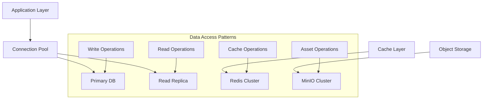

## 5.3 API DESIGN

### 5.3.1 REST Endpoints

| Endpoint | Method | Purpose | Authentication |
|----------|---------|---------|----------------|
| /api/v1/agents | POST | Create new agent | JWT + API Key |
| /api/v1/agents/{id} | GET | Retrieve agent details | JWT |
| /api/v1/agents/{id}/metrics | GET | Get agent metrics | JWT |
| /api/v1/integrations | POST | Create integration | JWT + API Key |
| /api/v1/metrics/aggregate | GET | Get system metrics | JWT |

### 5.3.2 WebSocket Events

| Event | Direction | Purpose |
|-------|-----------|---------|
| agent.status | Server→Client | Real-time agent status updates |
| metrics.update | Server→Client | Live performance metrics |
| integration.health | Server→Client | Integration status changes |
| system.alerts | Server→Client | System-wide notifications |

### 5.3.3 Integration Architecture

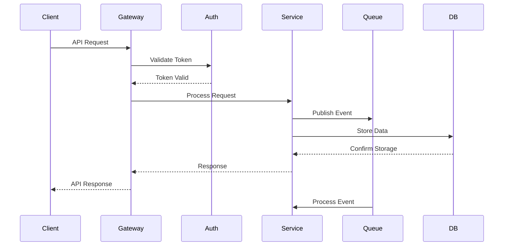

### 5.3.4 Error Handling

| Error Code | Description | Resolution Strategy |
|------------|-------------|-------------------|
| 400 | Bad Request | Validation feedback |
| 401 | Unauthorized | Token refresh flow |
| 403 | Forbidden | Permission check |
| 429 | Rate Limited | Exponential backoff |
| 500 | Server Error | Automatic retry |

# 6. USER INTERFACE DESIGN

## 6.1 Interface Components Key

```
NAVIGATION & ACTIONS
[#] Dashboard/Menu
[@] User Profile
[=] Settings
[?] Help/Info
[+] Add/Create
[x] Close/Delete
[<] Previous
[>] Next
[^] Upload
[!] Alert/Warning
[*] Important/Favorite
[$] Payment/Billing

INPUT ELEMENTS
[...] Text Input
[ ] Checkbox
( ) Radio Button
[v] Dropdown Menu
[Button] Action Button
[====] Progress Bar

LAYOUT
+---+ Box Border
|   | Vertical Line  
+--- Tree/Hierarchy
```

## 6.2 Main Dashboard

```
+----------------------------------------------------------+
|  AGENT AI Platform                [@] Profile    [?] Help  |
+----------------------------------------------------------+
|  [#] Dashboard                                            |
|  +-- Agents                                              |
|  +-- Integrations                                        |
|  +-- Analytics                                           |
|  +-- Settings                                            |
|----------------------------------------------------------
|                                                          |
|  Quick Actions                    System Status          |
|  [+] New Agent                   [====] CPU: 45%        |
|  [^] Import Config               [===] Memory: 35%      |
|                                  [!] 2 Alerts           |
|----------------------------------------------------------
|  Active Agents                                          |
|  +------------------------------------------------+     |
|  | Name         | Status    | Integration | Actions |     |
|  |--------------|-----------|-------------|---------|     |
|  | Sales Bot    | [*] Active | Zoho CRM   | [=] [x] |     |
|  | Order Proc.  | [*] Active | RMS        | [=] [x] |     |
|  | Lead Gen     | [!] Warning| Zoho CRM   | [=] [x] |     |
|  +------------------------------------------------+     |
+----------------------------------------------------------+
```

## 6.3 Agent Creation Interface

```
+----------------------------------------------------------+
|  Create New Agent                     [?] Help    [x]     |
+----------------------------------------------------------+
|                                                          |
|  Natural Language Input                                  |
|  +------------------------------------------------+     |
|  |                                                |     |
|  | [...................................................|     |
|  | Describe what you want your agent to do        |     |
|  |                                                |     |
|  +------------------------------------------------+     |
|                                                          |
|  Configuration                                          |
|  +------------------------+  +------------------------+  |
|  | Integration Type [v]   |  | Schedule        [v]   |  |
|  | ( ) Zoho CRM          |  | ( ) Real-time         |  |
|  | ( ) Restaurant Mgmt   |  | ( ) Hourly           |  |
|  | ( ) Custom API        |  | ( ) Daily            |  |
|  +------------------------+  +------------------------+  |
|                                                          |
|  Access Permissions                                      |
|  [ ] Read Customer Data                                  |
|  [ ] Write Customer Data                                 |
|  [ ] Access Reports                                      |
|                                                          |
|  [< Back]                    [Preview] [Create Agent]    |
+----------------------------------------------------------+
```

## 6.4 Integration Management

```
+----------------------------------------------------------+
|  Integrations                        [+] New    [?] Help  |
+----------------------------------------------------------+
|                                                          |
|  Active Connections                                      |
|  +------------------------------------------------+     |
|  | Service      | Status    | Last Sync  | Actions |     |
|  |--------------|-----------|------------|---------|     |
|  | Zoho CRM     | [*] Active | 5min ago   | [=] [x] |     |
|  | RMS Basic    | [*] Active | 2min ago   | [=] [x] |     |
|  | RMS Premium  | [!] Error  | 1hr ago    | [=] [x] |     |
|  +------------------------------------------------+     |
|                                                          |
|  Authentication                                          |
|  +------------------------------------------------+     |
|  | API Keys                                        |     |
|  | [.......] Current Key                          |     |
|  | [Generate New Key]                             |     |
|  |                                                |     |
|  | OAuth Status: Connected                        |     |
|  | [Refresh Token]                               |     |
|  +------------------------------------------------+     |
+----------------------------------------------------------+
```

## 6.5 Analytics Dashboard

```
+----------------------------------------------------------+
|  Analytics                          [@] Profile  [?] Help  |
+----------------------------------------------------------+
|  Time Range: [v] Last 7 Days                             |
|----------------------------------------------------------
|  Performance Metrics                                      |
|  +------------------------+  +------------------------+   |
|  | Agent Success Rate    |  | Response Time         |   |
|  | [==========] 98%      |  | [========] 180ms      |   |
|  +------------------------+  +------------------------+   |
|                                                          |
|  Agent Activity                                         |
|  +------------------------------------------------+     |
|  | Agent       | Requests | Errors | Avg. Time     |     |
|  |-------------|----------|---------|--------------|     |
|  | Sales Bot   | 1,240    | 12      | 195ms       |     |
|  | Order Proc. | 2,380    | 8       | 165ms       |     |
|  | Lead Gen    | 890      | 45      | 210ms       |     |
|  +------------------------------------------------+     |
|                                                          |
|  System Health                                          |
|  [====] CPU Usage: 45%                                  |
|  [===] Memory Usage: 35%                                |
|  [======] Network: 60%                                  |
|                                                          |
|  [Export Report] [Schedule Report]                      |
+----------------------------------------------------------+
```

## 6.6 Mobile Interface Layout

```
+------------------+
| AGENT AI     [@] |
+------------------+
| [#] Menu         |
+------------------+
| Active Agents    |
| +-- Sales Bot [*]|
| +-- Orders   [*]|
| +-- Leads    [!]|
+------------------+
| Quick Actions    |
| [+] New Agent    |
| [=] Settings     |
| [?] Help         |
+------------------+
| Status           |
| CPU    [====]45% |
| Memory [===]35%  |
| [!] 2 Alerts     |
+------------------+
```

## 6.7 Responsive Design Breakpoints

| Breakpoint | Width | Layout Adjustments |
|------------|-------|-------------------|
| Desktop | ≥1200px | Full sidebar, expanded tables |
| Tablet | ≥768px | Collapsed sidebar, scrollable tables |
| Mobile | ≥320px | Bottom navigation, stacked cards |

## 6.8 Theme Specifications

| Element | Light Theme | Dark Theme |
|---------|-------------|------------|
| Background | #FFFFFF | #1E1E1E |
| Primary Text | #333333 | #FFFFFF |
| Secondary Text | #666666 | #CCCCCC |
| Accent Color | #2196F3 | #64B5F6 |
| Warning Color | #FFA000 | #FFB74D |
| Error Color | #D32F2F | #EF5350 |
| Success Color | #388E3C | #66BB6A |

# 7. SECURITY CONSIDERATIONS

## 7.1 AUTHENTICATION AND AUTHORIZATION

### Authentication Methods

| Method | Use Case | Implementation |
|--------|-----------|----------------|
| OAuth 2.0 + OIDC | Primary user authentication | Auth0 integration with JWT tokens |
| API Keys | Service-to-service auth | Encrypted keys with automatic rotation |
| Multi-Factor Authentication | High-security operations | Time-based OTP via Auth0 |
| Service Accounts | Agent operations | Limited-scope JWT tokens |
| SSO | Enterprise users | SAML 2.0 via Auth0 |

### Authorization Framework

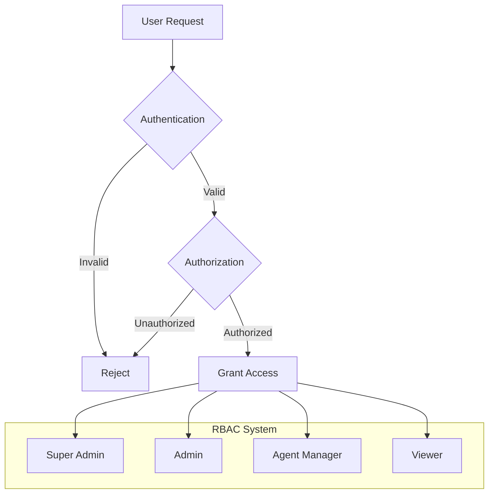

### Role Permissions Matrix

| Role | Agent Creation | Integration Config | Monitoring | Admin Functions |
|------|----------------|-------------------|------------|-----------------|
| Super Admin | ✓ | ✓ | ✓ | ✓ |
| Admin | ✓ | ✓ | ✓ | Limited |
| Agent Manager | ✓ | Limited | ✓ | - |
| Viewer | - | - | ✓ | - |

## 7.2 DATA SECURITY

### Encryption Standards

| Data State | Method | Key Management |
|------------|---------|----------------|
| At Rest | AES-256-GCM | AWS KMS with automatic rotation |
| In Transit | TLS 1.3 | Managed certificates via Let's Encrypt |
| In Memory | Secure enclaves | Hardware-level encryption |
| Backups | AES-256-CBC | Offline master key with split knowledge |

### Data Classification

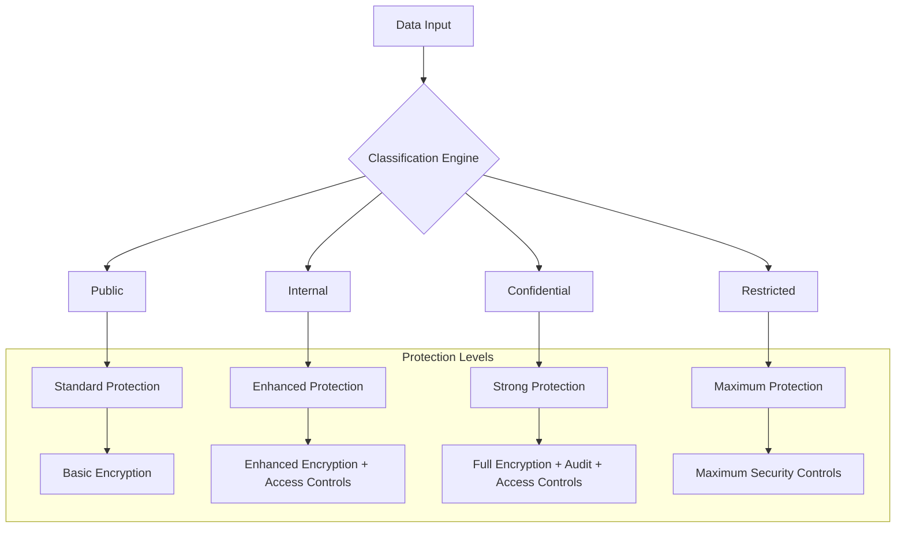

## 7.3 SECURITY PROTOCOLS

### Security Implementation

```mermaid
flowchart TD
    A[Security Layer] --> B[Prevention]
    A --> C[Detection]
    A --> D[Response]
    
    B --> E[WAF]
    B --> F[Rate Limiting]
    B --> G[Input Validation]
    
    C --> H[IDS/IPS]
    C --> I[Audit Logging]
    C --> J[Monitoring]
    
    D --> K[Incident Response]
    D --> L[Auto-remediation]
    D --> M[Backup Recovery]
```

### Security Controls

| Control Type | Implementation | Monitoring |
|--------------|----------------|------------|
| Access Control | Role-based + IP whitelisting | Real-time access logs |
| Rate Limiting | Redis-based with sliding window | Usage metrics dashboard |
| Input Validation | Server-side validation + WAF rules | Security event logging |
| Session Management | Redis session store with auto-expiry | Session activity monitoring |
| API Security | OAuth 2.0 + rate limiting + CORS | API usage analytics |

### Compliance Requirements

| Standard | Requirements | Implementation |
|----------|--------------|----------------|
| GDPR | Data privacy controls | Data encryption + access logs |
| SOC 2 | Security controls | Continuous monitoring + auditing |
| PCI DSS | Payment data security | Tokenization + encryption |
| HIPAA | Health data protection | Enhanced access controls |
| ISO 27001 | Security management | Security framework implementation |

### Security Monitoring

```mermaid
graph TD
    A[Security Events] --> B{Event Processor}
    B --> C[Low Priority]
    B --> D[Medium Priority]
    B --> E[High Priority]
    B --> F[Critical]
    
    C --> G[Log & Monitor]
    D --> H[Alert & Investigate]
    E --> I[Immediate Response]
    F --> J[Emergency Protocol]
    
    subgraph "Response Actions"
        G --> K[Daily Review]
        H --> L[Security Team Alert]
        I --> M[Automatic Mitigation]
        J --> N[System Lockdown]
    end
```

# 8. INFRASTRUCTURE

## 8.1 DEPLOYMENT ENVIRONMENT

The AGENT AI Platform utilizes a cloud-native architecture with multi-region deployment capabilities to ensure high availability and optimal performance.

| Environment | Purpose | Configuration |
|------------|----------|---------------|
| Production | Live system serving end users | Multi-region, High Availability |
| Staging | Pre-production testing | Single region, Production mirror |
| Development | Active development and testing | Single region, Reduced resources |
| DR | Disaster recovery standby | Secondary region, Warm standby |

### Regional Distribution

```mermaid
graph TB
    subgraph "Primary Region"
        A[Load Balancer] --> B[Application Cluster]
        B --> C[(Primary Database)]
        B --> D[Cache Cluster]
    end
    
    subgraph "Secondary Region"
        E[Load Balancer] --> F[Application Cluster]
        F --> G[(Replica Database)]
        F --> H[Cache Cluster]
    end
    
    C -.->|Replication| G
    D -.->|Sync| H
    
    I[Global DNS] --> A
    I --> E
```

## 8.2 CLOUD SERVICES

| Service Category | Provider | Service | Purpose |
|-----------------|----------|----------|----------|
| Compute | AWS | EKS | Kubernetes management |
| Storage | AWS | S3 | Object storage |
| Database | AWS | RDS | PostgreSQL hosting |
| Cache | AWS | ElastiCache | Redis cluster |
| CDN | AWS | CloudFront | Content delivery |
| DNS | AWS | Route 53 | Global DNS management |
| Monitoring | AWS | CloudWatch | System monitoring |
| Security | AWS | KMS | Key management |

## 8.3 CONTAINERIZATION

```mermaid
graph TD
    subgraph "Container Architecture"
        A[Base Images] --> B[Service Images]
        B --> C[Application Containers]
        
        subgraph "Service Images"
            D[NLP Service]
            E[Agent Service]
            F[Integration Service]
            G[Monitoring Service]
        end
        
        subgraph "Supporting Images"
            H[Nginx]
            I[Redis]
            J[Prometheus]
        end
    end
```

### Container Specifications

| Service | Base Image | Resource Limits |
|---------|------------|-----------------|
| NLP Service | python:3.11-slim | CPU: 2, Memory: 4Gi |
| Agent Service | node:20-alpine | CPU: 1, Memory: 2Gi |
| Integration Service | golang:1.20-alpine | CPU: 1, Memory: 2Gi |
| Monitoring Service | grafana/grafana | CPU: 0.5, Memory: 1Gi |

## 8.4 ORCHESTRATION

```mermaid
graph TB
    subgraph "Kubernetes Architecture"
        A[Ingress Controller] --> B[Service Mesh]
        B --> C[Application Pods]
        
        subgraph "Control Plane"
            D[API Server]
            E[Scheduler]
            F[Controller Manager]
        end
        
        subgraph "Data Plane"
            G[Worker Nodes]
            H[Storage Classes]
            I[Network Policies]
        end
    end
```

### Cluster Configuration

| Component | Configuration | Purpose |
|-----------|--------------|----------|
| Node Pools | 3-5 nodes per region | Application workloads |
| Autoscaling | Min: 3, Max: 10 nodes | Dynamic scaling |
| Network Policy | Calico | Pod network security |
| Service Mesh | Istio | Traffic management |
| Storage | EBS CSI Driver | Persistent storage |

## 8.5 CI/CD PIPELINE

```mermaid
graph LR
    A[Code Push] --> B[Build]
    B --> C[Test]
    C --> D[Security Scan]
    D --> E[Artifact Creation]
    E --> F[Deploy to Staging]
    F --> G[Integration Tests]
    G --> H[Deploy to Production]
    
    subgraph "Quality Gates"
        I[Code Coverage]
        J[Security Checks]
        K[Performance Tests]
    end
    
    C --> I
    D --> J
    G --> K
```

### Pipeline Stages

| Stage | Tools | Success Criteria |
|-------|-------|-----------------|
| Build | GitHub Actions | Clean build with no errors |
| Test | Jest, PyTest | 85% code coverage |
| Security | SonarQube, OWASP | No high/critical issues |
| Artifact | Docker Registry | Signed container images |
| Deployment | ArgoCD | Successful rollout |
| Monitoring | Prometheus | Health check passing |

### Deployment Strategy

```mermaid
graph TD
    A[Git Repository] --> B[CI Pipeline]
    B --> C[Container Registry]
    C --> D[ArgoCD]
    D --> E[Staging Cluster]
    E --> F[Production Cluster]
    
    subgraph "Deployment Controls"
        G[Manual Approval]
        H[Automated Tests]
        I[Rollback Plan]
    end
    
    E --> G
    G --> F
    F --> I
```

# 8. APPENDICES

## 8.1 ADDITIONAL TECHNICAL INFORMATION

### Development Environment Setup

```mermaid
graph TD
    A[Local Development] -->|Docker Compose| B[Development Stack]
    B --> C[Frontend Container]
    B --> D[Backend Services]
    B --> E[Local DBs]
    
    subgraph "Local Tools"
        F[VS Code]
        G[Git]
        H[Node.js]
        I[Python]
        J[Go]
    end
    
    subgraph "Testing Tools"
        K[Jest]
        L[PyTest]
        M[Postman]
    end
```

### Error Code Reference

| Error Code | Category | Description | Resolution |
|------------|----------|-------------|------------|
| AG-001 | Agent Creation | Invalid natural language input | Provide more detailed requirements |
| AG-002 | Integration | Failed API connection | Verify credentials and endpoint status |
| AG-003 | Deployment | Container orchestration failure | Check resource availability |
| AG-004 | Performance | Agent memory threshold exceeded | Optimize resource allocation |
| AG-005 | Security | Authentication token expired | Refresh authentication credentials |

## 8.2 GLOSSARY

| Term | Definition |
|------|------------|
| Agent Runtime | The execution environment where generated agents operate |
| Business Logic | Rules and workflows that define agent behavior |
| Container Orchestration | Management of automated container deployment and scaling |
| Data Pipeline | Automated flow of data between systems and processes |
| Event-Driven Architecture | System design pattern based on event production and consumption |
| Failover | Switching to redundant system components during failures |
| Hot Standby | Secondary system ready to take over operations immediately |
| Integration Endpoint | Connection point for external service communication |
| Microservices | Architecture style where applications are collections of loosely coupled services |
| Service Mesh | Infrastructure layer for service-to-service communication |
| Warm Standby | Backup system that requires some preparation before taking over |
| Zero-Trust Security | Security model requiring verification for all system access |

## 8.3 ACRONYMS

| Acronym | Full Form |
|---------|-----------|
| ACID | Atomicity, Consistency, Isolation, Durability |
| AES | Advanced Encryption Standard |
| CDN | Content Delivery Network |
| CORS | Cross-Origin Resource Sharing |
| CSI | Container Storage Interface |
| DNS | Domain Name System |
| EKS | Elastic Kubernetes Service |
| ETL | Extract, Transform, Load |
| GORM | Go Object Relational Mapper |
| HCL | HashiCorp Configuration Language |
| HIPAA | Health Insurance Portability and Accountability Act |
| IaC | Infrastructure as Code |
| JDBC | Java Database Connectivity |
| K8s | Kubernetes |
| KMS | Key Management Service |
| MTBF | Mean Time Between Failures |
| MTTR | Mean Time To Repair |
| NLP | Natural Language Processing |
| OWASP | Open Web Application Security Project |
| PCI DSS | Payment Card Industry Data Security Standard |
| RBAC | Role-Based Access Control |
| RMS | Restaurant Management System |
| RTL | Right-to-Left |
| SAML | Security Assertion Markup Language |
| SOC | System and Organization Controls |
| TLS | Transport Layer Security |
| WAF | Web Application Firewall |