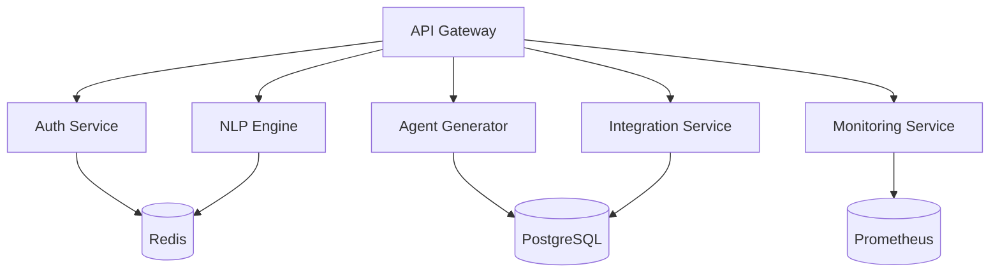

# AGENT AI Platform - Backend Services

## Overview

The AGENT AI Platform backend is a microservices-based architecture that enables natural language-driven agent creation and management. This document provides comprehensive setup instructions and development guidelines for the backend services ecosystem.

### System Architecture



### Key Features
- Natural language processing for agent generation
- Secure authentication and authorization
- Real-time monitoring and metrics
- Scalable microservices architecture
- Enterprise-grade integration capabilities

### Technology Stack
- Node.js 20.0.0+
- Python 3.11.0+
- Go 1.20.0+
- PostgreSQL 15
- Redis 7
- Docker 24.0.0+
- Kubernetes 1.27+

## Prerequisites

Ensure you have the following installed:
```bash
# Required versions
Node.js >= 20.0.0
npm >= 9.0.0
Docker >= 24.0.0
Docker Compose >= 2.20.0
Python >= 3.11.0
Go >= 1.20.0
```

## Getting Started

### Installation

1. Clone the repository and install dependencies:
```bash
git clone https://github.com/your-org/agent-platform.git
cd agent-platform/backend
npm install
```

2. Configure environment variables:
```bash
cp .env.example .env
# Edit .env with your configuration
```

3. Start the development environment:
```bash
docker-compose up -d
```

### Health Checks

Verify services are running:
```bash
# API Gateway
curl http://localhost:3000/health

# NLP Engine
curl http://localhost:8000/health

# Agent Generator
curl http://localhost:8080/health

# Auth Service
curl http://localhost:8081/health
```

## Services

### API Gateway
- Port: 3000
- Purpose: Route and authenticate requests
- Stack: Node.js, Express, Kong
- Configuration: `api-gateway/config/default.json`

### NLP Engine
- Port: 8000
- Purpose: Natural language processing
- Stack: Python, FastAPI, TensorFlow
- Configuration: `nlp-engine/config/settings.py`

### Agent Generator
- Port: 8080
- Purpose: Agent creation and management
- Stack: Node.js, Express
- Configuration: `agent-generator/config/default.json`

### Auth Service
- Port: 8081
- Purpose: Authentication and authorization
- Stack: Node.js, Express, Auth0
- Configuration: `auth-service/config/default.json`

### Integration Service
- Port: 8082
- Purpose: External service integration
- Stack: Go, Fiber
- Configuration: `integration-service/config/config.yaml`

### Monitoring Service
- Prometheus: 9090
- Grafana: 3000
- Purpose: System metrics and monitoring
- Stack: Prometheus, Grafana
- Configuration: `prometheus/prometheus.yml`

## Development

### Code Structure
```
backend/
├── api-gateway/
├── auth-service/
├── agent-generator/
├── nlp-engine/
├── integration-service/
├── monitoring-service/
├── docker-compose.yml
├── package.json
└── README.md
```

### Testing Requirements
- Unit test coverage: ≥85%
- Integration tests required for all APIs
- End-to-end tests for critical flows
```bash
# Run all tests
npm test

# Run specific service tests
npm test --workspace=auth-service
```

### Linting Rules
```bash
# Check linting
npm run lint

# Fix linting issues
npm run lint -- --fix
```

### CI/CD Pipeline
1. Code Push
2. Automated Tests
3. Security Scan
4. Docker Build
5. Deployment
   - Staging: Automated
   - Production: Manual approval

### Performance Guidelines
- API response time: <200ms
- Memory usage: <70%
- CPU usage: <60%
- Error rate: <0.1%

### Security Guidelines
- All endpoints must be authenticated
- Rate limiting enabled
- Input validation required
- HTTPS only
- Regular security scans
- Audit logging enabled

## Troubleshooting

### Common Issues

1. Service Connection Errors
```bash
# Check service health
docker-compose ps
docker-compose logs [service-name]
```

2. Database Connection Issues
```bash
# Verify PostgreSQL connection
docker-compose exec postgres pg_isready
```

3. Redis Connection Issues
```bash
# Check Redis connection
docker-compose exec redis redis-cli ping
```

### Performance Issues

1. Monitor resource usage:
```bash
docker stats
```

2. Check service logs:
```bash
docker-compose logs -f [service-name]
```

3. Monitor metrics:
- Access Prometheus: http://localhost:9090
- Access Grafana: http://localhost:3000

## Contributing

1. Branch naming convention:
   - feature/feature-name
   - bugfix/bug-description
   - hotfix/issue-description

2. Commit message format:
   - feat: Add new feature
   - fix: Fix bug
   - docs: Update documentation
   - test: Add tests
   - refactor: Code refactoring

3. Pull request requirements:
   - Tests passed
   - Code review approved
   - No security issues
   - Documentation updated

## License

Copyright (c) 2023 AGENT AI Platform. All rights reserved.